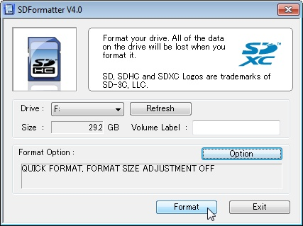

# Making a class set of SD cards

Begin by downloading and setting up one SD Card with all the software you require. This can then become your master image which you can use to create more cards from. 

## Format your SD Card

It is best to format your SD card on your computer or laptop before copying the NOOBS files onto it or adding the Raspbian image. To do this:

1. Visit the [SD Association’s website](http://www.sdcard.org/) and download [SD Formatter 4.0](https://www.sdcard.org/downloads/formatter_4/index.html) for either Windows or Mac.
1. Follow the instructions to install the software.
1. Insert your SD card into the computer or laptop’s SD card reader and make a note of the drive letter allocated to it, e.g. `F:/`
1. In SD Formatter, select the drive letter for your SD card and format it.

  
  
## Download & image Raspbian
Once you have formatted your SD Card, download and install the image directly.

1. Using a computer with an SD card reader, visit the official Raspberry Pi [Downloads page](http://www.raspberrypi.org/downloads/).
1. Click on **Raspbian**.

  

1. Click on the Download ZIP button under ‘Raspbian Jessie (full desktop image)’, and select a folder to save it to.
1. Extract the files from the zip.

  

1. Visit [etcher.io](http://www.etcher.io/) and download and install the Etcher SD card image utility.
1. Run Etcher and select the Raspbian image you unzipped on your computer or laptop.
1. Then select the SD card drive. Note that the software may have already selected thr right drive.
1. Finally click **Burn** to transfer Raspbian to the SD card. You will see a progress bar that tells you how much is left to do. Once complete the utility will automatically eject or unmount the SD card so it is safe to remove it from the computer.

    

## Update & Upgrade 
It is best to ensure you have the most up to date software on your SD Card before making copies of it. 

1. Put the SD Card into a Raspberry Pi connected to the internet via ethernet or wifi and boot it.
1. Once the desktop has loaded, open a **Terminal** window by clicking on **Main Menu**, **Accessories** and **Terminal**. Alternatively you can click on the terminal icon in the taskbar.
1. Next type the following:

  ```bash
  sudo apt-get update
  ```
1. Then press **Enter** on the keyboard.

 You will see some text appear very quickly. Simply wait for the progress indictator at the bottom reach 100% and then you will be returned to command line prompt.

## Upgrade

Once the update process is complete, and any information abou new versions of applications are downloaded, you will need to install the upgrades.

1. In a terminal window or on the command line type:

  ```bash
  sudo apt-get upgrade
  ```
1. Then press **Y** or **Enter** on the keyboard when asked and your upgrades will be installed.

## Downloading and Installing Applications on your Raspberry Pi

You can use text commands to download and install extra applications that you may wish to use. In the 'What you will need' section of a Raspberry Pi Resource, for example, you may see listed a piece of software that you will need in order to complete the activity or project. To download extra software applications that you want to use on your Raspberry Pi and install them, you will need to be connected to the internet with ethernet or wifi.

1. From a terminal window, or on the command line simply type `sudo apt-get install <name of software>` and press **Enter** on the keyboard.
1. After searching for the package and downloading it, you will be asked if you want to continue with the installation. Press **Y** or **Enter** on the keyboard to continue.

## Checking space on an SD card

When running `sudo apt-get upgrade`, it will show how much data will be downloaded and how much space it will take up on the SD card. It's worth checking with `df -h` that you have enough disk space free, as unfortunately apt will not do this for you. Also be aware that downloaded package files (.deb files) are kept in `/var/cache/apt/archives`. You can remove these in order to free up space with `sudo apt-get clean`.

## Finally clone the master SD card to make a class set

One SD Card will not be enough for a whole class. Now you need to make a copy of your SD card and clone it to others. 

### Windows

1. Open Win32 disk imager again and select a location to save your image, using the same part of the application as you used to select an image file to load onto an SD card. 
1. Enter the name you want to save it as at the bottom of the file selection window, e.g `my-class-pi-image`. Do not save it with the name of another SD card image or you will overwrite it!
1. Click **read** to start copying the SD card image to your computer.

### Mac
1. Open a terminal window by clicking on applications, then utilities and terminal.
1. Type `diskutil list`and press **enter**. It will show a list of all filesystems connected to your Mac.
1. Insert the SD card and type `diskutil list` and press **enter** again. Take a note of the SD card drive. It should read something like `/dev/disk3`. Take note of the final number (in the example, that was 3).
1. Finally, use `dd` to read the image from the SD card to a file by typing `sudo dd if=/dev/rdiskX of=~/Desktop/pi.img bs=1m`. Note the use of `rdiskX` instead of `diskX`. Make sure to replace the `X` with the number from above (e.g. 3). This will save it to an image file on the desktop called `pi.img`.

Now you have your master image saved, you can use Etcher like you did in step 2 to burn new SD cards. 

## What next?
- Return to [Teachers' Classroom Guide](README.md)
